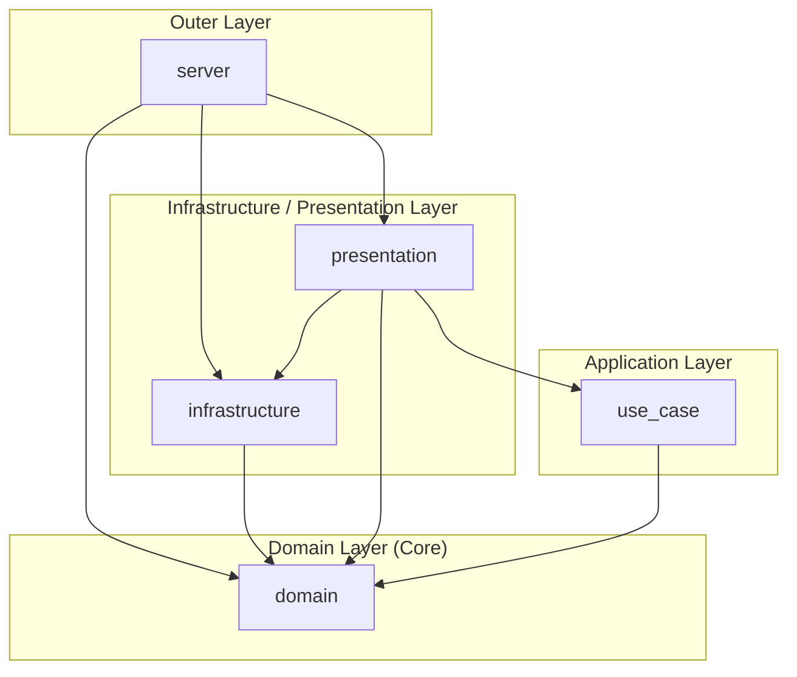

# actix-onion-template

A template for building web applications using Actix Web and the Onion architecture.

## Architecture

This template follows the Onion architecture, where dependencies flow strictly inward.



| Crate            | Kind   | Responsibility                                |
| ---------------- | ------ | --------------------------------------------- |
| `domain`         | lib    | Entities, value objects, repository traits    |
| `use_case`       | lib    | Application services, business logic          |
| `presentation`   | lib    | HTTP handlers, routing                        |
| `infrastructure` | lib    | Repository implementations, external services |
| `server`         | binary | Dependency injection, entry point             |

## Tech Stack

| Category  | Technology                                              |
| --------- | ------------------------------------------------------- |
| Framework | [Actix Web](https://actix.rs) 4                         |
| Database  | PostgreSQL                                              |
| ORM / SQL | [sqlx](https://github.com/launchbadge/sqlx) 0.8         |
| Migration | [Atlas](https://atlasgo.io) (versioned migration style) |
| Runtime   | [Tokio](https://tokio.rs)                               |
| Tooling   | [mise](https://mise.jdx.dev)                            |

## Development

### Pre-requirements

- [mise](https://mise.jdx.dev)
- [rustup](https://rustup.rs)
- [Docker](https://www.docker.com) (with Compose)

### Setup

```bash
mise run setup
mise run db-up-d
mise run db-migrate
```

### Commands

| Command                  | Alias         | Description                        |
| ------------------------ | ------------- | ---------------------------------- |
| `mise run dev`           | `mise run d`  | Start all development services     |
| `mise run setup`         | `mise run s`  | Install tools and set up git hooks |
| `mise run fix`           | `mise run f`  | Auto-fix all issues                |
| `mise run check`         | `mise run c`  | Check for all issues               |
| `mise run fix-and-check` | `mise run fc` | Fix and then check                 |

#### Rust

| Command                     | Alias         | Description                     |
| --------------------------- | ------------- | ------------------------------- |
| `mise run rs-run`           | `mise run rr` | Run the application             |
| `mise run rs-watch`         | `mise run rw` | Run with hot reload (watchexec) |
| `mise run rs-fix`           | `mise run rf` | Fix Rust code (clippy + fmt)    |
| `mise run rs-check`         | `mise run rc` | Check Rust code                 |
| `mise run rs-build`         |               | Build the application           |
| `mise run rs-build-release` |               | Build in release mode           |
| `mise run rs-clean`         |               | Clean build artifacts           |

#### Database

| Command                | Description                              |
| ---------------------- | ---------------------------------------- |
| `mise run db-up-d`     | Start the database container (detached)  |
| `mise run db-up`       | Start the database container (attached)  |
| `mise run db-stop`     | Stop the database container              |
| `mise run db-down`     | Stop and remove the database container   |
| `mise run db-logs`     | Follow database container logs           |
| `mise run db-migrate`  | Apply pending migrations                 |
| `mise run db-rollback` | Roll back the last migration             |
| `mise run db-new`      | Create a new migration file              |

## Contributing

See [docs/CONTRIBUTING.md](docs/CONTRIBUTING.md).

## License

[MIT](LICENSE)
